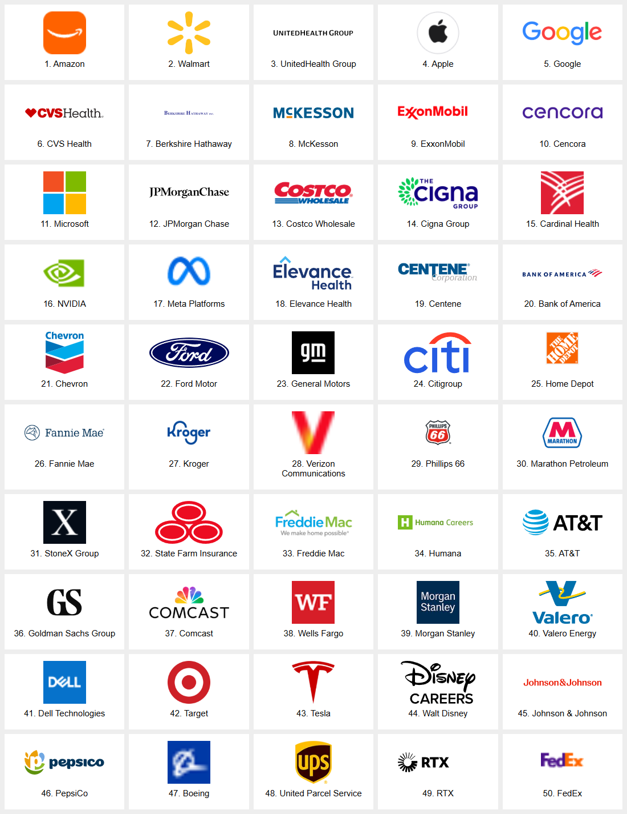

# Fortune 50 scraper and logo validation — September 4, 2026

Prepared **53 live-tested monitors across all 50 companies**, with **50/50 remote logos loaded and visually checked in Chromium**. The runs returned 11,963 normalized records in total; this is a point-in-time sum across monitors, not a unique global job count. All 53 sampled public job-detail links returned HTTP 200.

**Coverage is bounded, not exhaustive. Tesla covers Tesla Automation in Germany only (two visible listings); its worldwide careers site remains blocked with HTTP 403.** Berkshire remains limited to GEICO and Homestate Companies. Bank of America covers the U.S. lateral board; Valero covers six featured U.S. roles. Most large-company feeds intentionally stop at a safe page/result limit and set `metadata.partial_listing` so unseen jobs are not closed. These limitations are recorded in monitor verification warnings and below.

The former Fortune 10 collection has been promoted to **Fortune 50 — 2026** under the stable catalog ID `fortune-50-2026`. Nothing was pushed, published, installed into the user's monitors, or scheduled. Company and monitor identities remain normalized and reusable by the existing human UI and agent contracts.

## Verification

- Every saved monitor ran through the canonical JobHound `ScraperRecipe` and `run_scraper`, with real public network requests and host confinement.
- Inspected representative titles, employers, locations, source URLs, warnings, and completeness. Stored recipe hashes tie evidence to the tested behavior.
- Checked 53 sample job links (one per monitor): all HTTP 200.
- Downloaded and decoded logo candidates, visually rejected wrong/blank/product logos, then embedded the final remote URLs from a local HTTP origin: 50 loaded, zero failed.
- Catalog validation, generation, tests, JobHound pytest, and the web production build passed. The web build reports its existing bundle-size warning.
- The generated collection contains 50 ranked companies and 53 monitors. Generated catalog output remains derived from the authored collection and company records.

## Brief scaling report

1. **Discover the ATS behind the branded site.** Public candidate-home and application links revealed reusable Workday tenant/site pairs. The final strategy mix is 11 generic_html, 7 generic_json, 7 playwright, 28 workday.
2. **Distinguish public job URLs from application login URLs.** iCIMS/Jibe feeds expose readable listings at `data.meta_data.canonical_url`; `data.apply_url` often lands on a login page. A successful JSON response alone missed this problem.
3. **Validate links after normalization.** Google's existing relative links resolved to a duplicated `jobs/jobs` path. Correcting its careers base and increasing the monitor revision fixed the source links.
4. **Test pagination and field sizes against real data.** Microsoft returns only ten results despite a larger requested count. State Farm's combined location field exceeded the schema limit; its concise `short_location` field works. Browser lists can render only the visible cards.
5. **Treat corporate and subsidiary coverage separately.** Humana and CenterWell, Morgan Stanley experienced and graduate boards, and Berkshire's subsidiaries have separate monitors. Tesla Automation is explicitly scoped; the blocked global feed is not presented as verified.
6. **Verify logos in a browser, not just with GET.** Automatic discovery found a Facebook icon on Microsoft's page, Apple product art, white-on-white logos, and a partial FedEx mark. Morgan Stanley's official image fetched successfully but failed when embedded; a verified alternate brand icon worked.
7. **Keep evidence beside normalized source records.** Reuse existing company IDs, retain one owner per recipe, store verification timestamps/hash/count/warnings, and change collection references only in the separate promotion step.

## Company coverage

| Rank | Company | Monitors | Observed records | Scope |
|---|---|---|---:|---|
| 1 | Amazon | amazon | 1,000 | Bounded public listing; consult each monitor for limits. |
| 2 | Walmart | walmart | 27 | Bounded public listing; consult each monitor for limits. |
| 3 | UnitedHealth Group | unitedhealth-group | 15 | Bounded public listing; consult each monitor for limits. |
| 4 | Apple | apple | 20 | Public first page; most retail postings omit location in the listing markup. |
| 5 | Google | google | 20 | Bounded public listing; consult each monitor for limits. |
| 6 | CVS Health | cvs-health | 200 | Bounded public listing; consult each monitor for limits. |
| 7 | Berkshire Hathaway | berkshire-geico, berkshire-homestate | 313 | No centralized parent-company board. Separate GEICO and Berkshire Hathaway Homestate Companies boards only. |
| 8 | McKesson | mckesson | 15 | Bounded public listing; consult each monitor for limits. |
| 9 | ExxonMobil | exxonmobil | 617 | Bounded public listing; consult each monitor for limits. |
| 10 | Cencora | cencora | 500 | Bounded public listing; consult each monitor for limits. |
| 11 | Microsoft | microsoft | 10 | Eightfold public search returns 10 results regardless of requested num; first page only. |
| 12 | JPMorgan Chase | jpmorgan-chase | 25 | Bounded public listing; consult each monitor for limits. |
| 13 | Costco Wholesale | costco | 1,000 | Bounded public listings include standing recruitment pools; an active listing does not guarantee an immediate vacancy. |
| 14 | Cigna Group | cigna | 200 | Bounded public listing; consult each monitor for limits. |
| 15 | Cardinal Health | cardinal-health | 500 | Bounded public listing; consult each monitor for limits. |
| 16 | NVIDIA | nvidia | 200 | Bounded public listing; consult each monitor for limits. |
| 17 | Meta Platforms | meta | 10 | Company-specific public DirectEmployers syndication; first 10 listings. Ownership checked against company_exact=Meta in the public source feed. |
| 18 | Elevance Health | elevance-health | 200 | Bounded public listing; consult each monitor for limits. |
| 19 | Centene | centene | 211 | Bounded public listing; consult each monitor for limits. |
| 20 | Bank of America | bank-of-america | 200 | U.S. lateral-hire board; international and campus hiring are outside this monitor. |
| 21 | Chevron | chevron | 15 | Bounded public listing; consult each monitor for limits. |
| 22 | Ford Motor | ford | 15 | Bounded public listing; consult each monitor for limits. |
| 23 | General Motors | general-motors | 500 | Bounded public listing; consult each monitor for limits. |
| 24 | Citigroup | citigroup | 200 | Bounded public listing; consult each monitor for limits. |
| 25 | Home Depot | home-depot | 200 | Public CareerDepot board; separate store/hourly hiring channels may not be included. |
| 26 | Fannie Mae | fannie-mae | 57 | Bounded public listing; consult each monitor for limits. |
| 27 | Kroger | kroger | 25 | Bounded public listing; consult each monitor for limits. |
| 28 | Verizon Communications | verizon | 500 | Bounded public listing; consult each monitor for limits. |
| 29 | Phillips 66 | phillips-66 | 15 | Bounded public listing; consult each monitor for limits. |
| 30 | Marathon Petroleum | marathon-petroleum | 128 | Bounded public listing; consult each monitor for limits. |
| 31 | StoneX Group | stonex | 160 | Bounded public listing; consult each monitor for limits. |
| 32 | State Farm Insurance | state-farm | 229 | Bounded public listing; consult each monitor for limits. |
| 33 | Freddie Mac | freddie-mac | 90 | Bounded public listing; consult each monitor for limits. |
| 34 | Humana | humana, humana-centerwell | 400 | Bounded public listing; consult each monitor for limits. |
| 35 | AT&T | att | 200 | Bounded public listing; consult each monitor for limits. |
| 36 | Goldman Sachs Group | goldman-sachs | 20 | Bounded public listing; consult each monitor for limits. |
| 37 | Comcast | comcast | 200 | Bounded public listing; consult each monitor for limits. |
| 38 | Wells Fargo | wells-fargo | 490 | Bounded public listing; consult each monitor for limits. |
| 39 | Morgan Stanley | morgan-stanley, morgan-stanley-experienced | 568 | Current public Workday external board; bounded to 500 listings. Separate students/graduate monitor is also available. |
| 40 | Valero Energy | valero | 6 | Six featured U.S. roles linked by the corporate careers page; not the complete Taleo inventory. |
| 41 | Dell Technologies | dell | 25 | Bounded public listing; consult each monitor for limits. |
| 42 | Target | target | 200 | Bounded public listing; consult each monitor for limits. |
| 43 | Tesla | tesla-automation | 2 | Tesla Automation subsidiary in Germany only; currently two visible cards per headless page. Tesla worldwide careers remains HTTP 403 Access Denied. This does not cover Tesla U.S. or worldwide hiring. |
| 44 | Walt Disney | disney | 10 | Bounded public listing; consult each monitor for limits. |
| 45 | Johnson & Johnson | johnson-johnson | 500 | Bounded public listing; consult each monitor for limits. |
| 46 | PepsiCo | pepsico | 1,000 | Bounded public listing; consult each monitor for limits. |
| 47 | Boeing | boeing | 200 | Bounded public listing; consult each monitor for limits. |
| 48 | United Parcel Service | ups | 200 | Bounded public listing; consult each monitor for limits. |
| 49 | RTX | rtx | 500 | Bounded public listing; consult each monitor for limits. |
| 50 | FedEx | fedex | 25 | Bounded public listing; consult each monitor for limits. |

## Evidence and logo sheet

[Structured verification evidence](fortune-50-2026-evidence.json) includes per-monitor samples, timestamps, hashes, warnings, and source-link checks.

Ranking references: [Fortune 2026 U.S. edition](https://fortune.com/ranking/fortune500/2026/) and [source-linked ranking list](https://www.sheetsteps.com/data/fortune-500-companies-2026). The latter includes private State Farm at rank 32; public-company-only lists omit it and shift the remaining ranks. Fortune 50 is not the Global 50.
